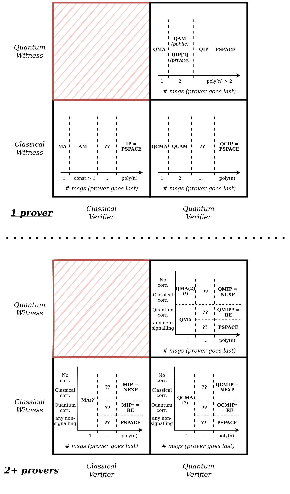

# What is QMA(2)?

QMA(2) is a class where the verifier ("Arthur"), a quantum computer, checks a computation from two unentangled provers ("Merlins"). The verifier receives two quantum  ("witnesses"), *which are guaranteed to be unentangled*. This is the key difference from QMA.

In QMA(2), the verifier is given the extra power of "unentanglement" [[ABDFS08]](https://arxiv.org/pdf/0804.0802.pdf). When a quantum computer's input is guaranteed two be two separable states, it might be able to "do more" than if it was initialized with an unknown quantum state. But how much more?

For more info, see this [QMA(2) primer](http://www.billfefferman.com/wp-content/uploads/2016/11/bill-qma2Tutorial.pdf) from Bill Fefferman.

# QMA($$k$$), QMA(2), QMA

We can imagine a generalization of QMA(2), where we are given $$k$$ quantum states that are guaranteed to be unentangled. In general, QMA($$k_1$$) $$\subseteq$$ QMA($$k_2$$), for $$k_1 \le k_2$$. If Arthur can verify given $$k_1$$ unentangled quantum states, then Arthur can verify given any $$k_2 \ge k_1$$ unentengled states, where the extra unentangled states can be ignored.

It turns out that QMA($$k$$) = QMA(2) [[HM13]](https://arxiv.org/pdf/1001.0017.pdf). Their approach uses the SWAP test (checking that two quantum states are similar); this primitive can be used for any $$k \ge 2$$.

But what about the standard class QMA; i.e., when $$k=1$$? This is still open, even in the oracle setting:

**Open problem [[Problem 2, Aaronson 2021]](https://arxiv.org/pdf/2109.06917.pdf)**: Is there any (classical or quantum) oracle $$\mathcal{O}$$ where QMA $$\ne$$ QMA(2)?

It's unlikely that QMA $$=$$ QMA(2), since determining whether a state is entangled or not is at least NP-hard [[Gharibian 2008]](https://arxiv.org/pdf/0810.4507.pdf).
# QMA(2)-complete problems

One natural problem for QMA(2) is the *sparse separable Hamiltonian problem* [[CD10]](https://arxiv.org/pdf/1111.5247.pdf): Decide if there is a separable state that has ground state $$\le a$$, or all states are $$\ge b$$, where $$b-a = \Omega(1/poly(n))$$. This is related to the *sparse Hamiltonian problem*, which is QMA-complete.

One strange result is that both the *k-local Hamiltonian problem* and the *k-local separable Hamiltonian problem* **are QMA-complete**. This means that knowing that the Hamiltonian is a sum of terms operating on only a constant number of qubits, even deciding whether a separable state is of low-energy is possible "without the power of unentanglement".

A natural open question here is: why is there a difference between the *sparse* setting and the *k-local* setting?

Pure state N-representability is in QMA(2), but may not be QMA(2)-complete [[LCV06]](https://arxiv.org/pdf/quant-ph/0609125.pdf).

# Features of QMA(2)

Surprisingly, both QMA and QMA(2) are equal to their "subset state" variants, where the input witness must be a uniform superposition over some subset of basis elements [[GKS16]](https://arxiv.org/pdf/1410.2882.pdf).

Upper bounds for QMA(2) have been hard to track down, except for QMA(2) $$\subseteq$$ NEXP. [[GSSSY18]](https://arxiv.org/pdf/1805.11139.pdf) shows that unless QMA(2) equals the third level of the quantum polynomial hierarchy, QMA(2) $$\subsetneq$$ NEXP. [[Ambainis 2014]](https://ieeexplore.ieee.org/abstract/document/6875473) and
[[GPY19]](https://arxiv.org/pdf/1909.05981.pdf) consider a complete problem for the class $$P^{QMA[\log]} = P^{||QMA}$$, which contains both $$coQMA$$ and $$QMA$$.

There are QMA($$k$$) protocols for 3-SAT [[ABDFS08]](https://arxiv.org/pdf/0804.0802.pdf) and 3-coloring [[BT07]](https://arxiv.org/pdf/0709.0738.pdf) (both NP-complete problems) that have sublinear-sized proofs. (Classically, we expect linear-sized proofs by the exponential time hypothesis (ETH)).

There was some problems amplifying success probabilities in QMA(2); something about "strong error reduction" vs "in-place error reduction". But it is now resolved.

# What's between QMA and QMA(2)?

There are a few ways I can think of to define classes between QMA and QMA(2):
1. Consider $$QMA\{e\}$$, where witnesses that have entanglement entropy along a defined bipartition of at most some $$e(n)$$. It's not immediately clear that these classes form a hierarchy; i.e $$QMA\{e'\} \subseteq QMA\{e\}$$ when $$e \le e'$$. Are there phase transitions between $$0 \le e(n) \le poly(n)$$?
2. Consider $$QMA(2)^{same}$$, where the witnesses are promised to be of the form $$\psi \otimes \psi $$. Is this as general as $$QMA(2)$$? (I think [[this paper]](https://arxiv.org/pdf/0804.0802.pdf) calls it $$SymQMA$$ and it might be...) If so, this makes $$QMA(2)$$ all about the power of *multiple copies*, not *unentanglement*. Perhaps there are connections to a no-cloning theorem.

# Between MA and RE: a graphical perspective

Consider the verifier-prover (Arthur-Merlin) style of protocols, with one prover. There are three *parameters* I can think of:
1. Is the verifier classical or quantum?
2. Is the verifier classical or quantum?
3. How many messages are being sent (prover always goes last)

With a classical verifier and witness:
* one message: MA
* two (or any constant number of messages): AM (or IP[const]; private-coin randomness isn't more powerful, by [[GS86]](https://dl.acm.org/doi/pdf/10.1145/12130.12137))
* super-constant messages: could be more powerful than AM
* any poly(n) messages: IP = PSPACE

With a quantum verifier and *classical* witness:
* one message: [QCMA](https://complexityzoo.net/Complexity_Zoo:Q#qcma)
* two messages: QCAM
* three or more messages: unknown
* any poly(n) messages: in between IP and QIP, so it's equal to PSPACE.

With a quantum verifier and witness:
* one message: QMA
* two messages: [QAM](https://complexityzoo.net/Complexity_Zoo:Q#qam) (public-coin) or QIP[2] (private-coin)
* three or more messages (up to poly(n)): QIP = PSPACE (by [[KW00]](https://cs.uwaterloo.ca/~watrous/Papers/QuantumInteractiveProofs.pdf))

If there are multiple Merlins, it depends also on (4.) how the Merlins are correlated: none, classically, quantumly, or arbitrarily (also called non-signalling). In general, classical correlation is no more powerful than no correlation, and more than 2 Merlins does not change things (but I haven't fully verified all of these claims):

With a classical verifier and witness:
* one message, regardless of correlation: MA (haven't formally proved this)
* two or more messages now depends on correlation:
    * for no or classical correlation, it's MIP[1] (which I think is equal to MIP= NEXP)!
    * for quantum correlation, it's MIP*[1] (which I think is equal to MIP* = RE)!
    * for non-signalling, it depends on the number of messages, but with an arbitrary poly(n) messages, it's PSPACE.

Surprisingly, with a quantum verifier and *classical* witness, nothing changes except MA becomes QCMA.

With a quantum verifier and witness:
* one message now **depends on correlation**:
    * QMA(2) if no or classical correlation (haven't formally proved this) (!!)
    * QMA if quantum correlation or no-signalling (haven't formally proved this)
* two or more messages splits further:
    * for no or classical correlation, it's QMIP[1] (which I think is equal to MIP= NEXP)!
    * for quantum correlation, it's QMIP*[1] (which I think is equal to MIP* = RE)!
    * for non-signalling, it depends on the number of messages, but with an arbitrary poly(n) messages, it's PSPACE.

If you have any references to verify these claims, please let me know.

Some natural questions from here are:
1. What do we know about QCAM? Is it equal to QCAM[const]?
2. Is QAM (or even AM) in QMA(2)?
3. Is there a time-hierarchy theorem about number of rounds for MA-style proofs?
4. Why is there a symmetry breaking for QMA(2) and QMA when going from one Merlin to multiple Merlins?
5. What other kinds of correlations are there? What about Signalling MIP*? What about Consensus MIP*? (Look at Mark Braverman's thesis)
6. What happens when the protocols allow for zero-gap or inverse-exponential-gap on the promises?
7. What happens when the protocols allow for perfect-completeness (like $$QMA_1$$)?

# Other resources:

- [2016 QuICS Workshop on QMA(2)](http://qma2016.quics.umd.edu/agenda)
- [[BCY11]](https://dl.acm.org/doi/pdf/10.1145/1993636.1993683) thinks about intermediate classes between QMA and QMA(2)
- [[KMY01]](https://arxiv.org/pdf/quant-ph/0110006.pdf):  the paper where QMA($$k$$) is defined
- some other papers on local hamiltonians: [[here]](https://quantumcomputing.stackexchange.com/questions/16589/the-complexity-of-lh-with-constant-gap), [[here]](https://arxiv.org/pdf/1309.7495.pdf), [[here]](https://arxiv.org/pdf/1311.3161.pdf), [[here]](https://quantum-journal.org/papers/q-2022-03-17-668/pdf/)

---

Thanks to Justin Yirka for direction when starting this document.

More to add? Email me at [kmarw@uchicago.edu](mailto:kmarw@uchicago.edu).
